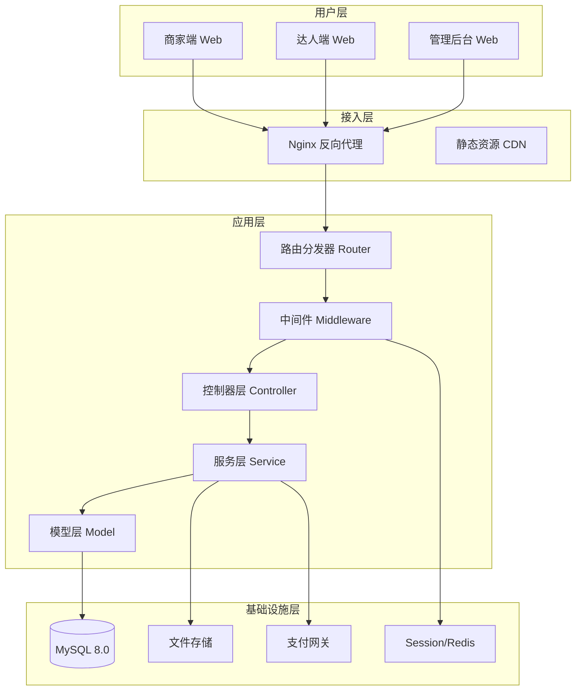
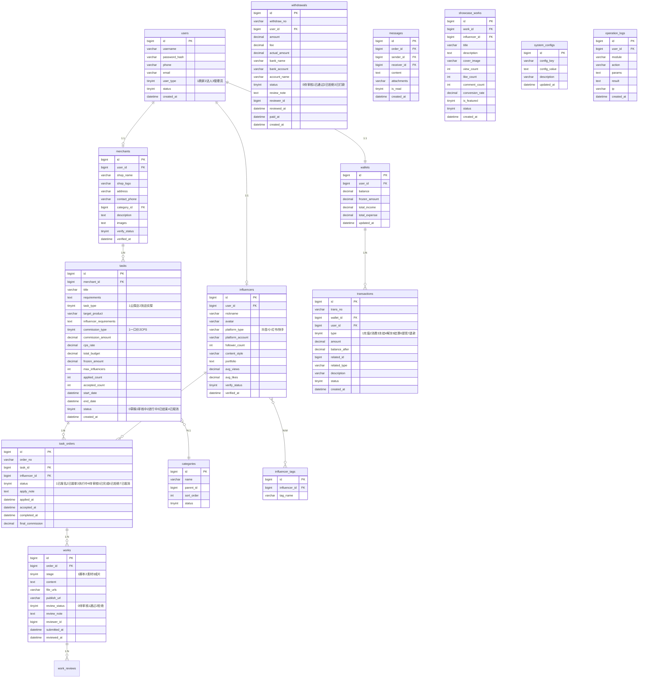

# 探店达人营销平台 - 系统设计文档

## 一、系统架构



## 二、数据库 ER 图



## 三、API 接口清单

### 3.1 公共接口 (PublicController)
| 方法 | 路径 | 描述 |
|------|------|------|
| POST | /api/auth/register | 用户注册 |
| POST | /api/auth/login | 用户登录 |
| POST | /api/auth/logout | 退出登录 |
| GET | /api/categories | 获取分类列表 |
| GET | /api/showcase | 获取内容广场数据 |

### 3.2 商家端接口 (MerchantController)
| 方法 | 路径 | 描述 |
|------|------|------|
| GET | /api/merchant/profile | 获取店铺信息 |
| PUT | /api/merchant/profile | 更新店铺信息 |
| POST | /api/merchant/tasks | 创建任务 |
| GET | /api/merchant/tasks | 任务列表 |
| GET | /api/merchant/tasks/{id} | 任务详情 |
| PUT | /api/merchant/tasks/{id} | 更新任务 |
| DELETE | /api/merchant/tasks/{id} | 取消任务 |
| GET | /api/merchant/tasks/{id}/applications | 报名列表 |
| POST | /api/merchant/applications/{id}/accept | 接受报名 |
| POST | /api/merchant/applications/{id}/reject | 拒绝报名 |
| POST | /api/merchant/works/{id}/review | 审核作品 |
| GET | /api/merchant/dashboard | 数据看板 |
| GET | /api/merchant/wallet | 钱包信息 |
| POST | /api/merchant/wallet/recharge | 充值 |
| GET | /api/merchant/transactions | 交易记录 |

### 3.3 达人端接口 (InfluencerController)
| 方法 | 路径 | 描述 |
|------|------|------|
| GET | /api/influencer/profile | 获取个人信息 |
| PUT | /api/influencer/profile | 更新个人信息 |
| GET | /api/influencer/tasks | 任务大厅 |
| GET | /api/influencer/tasks/{id} | 任务详情 |
| POST | /api/influencer/tasks/{id}/apply | 报名任务 |
| GET | /api/influencer/orders | 我的订单 |
| GET | /api/influencer/orders/{id} | 订单详情 |
| POST | /api/influencer/orders/{id}/works | 提交作品 |
| GET | /api/influencer/wallet | 钱包信息 |
| POST | /api/influencer/wallet/withdraw | 申请提现 |
| GET | /api/influencer/withdrawals | 提现记录 |
| GET | /api/influencer/messages | 消息列表 |
| POST | /api/influencer/messages | 发送消息 |

### 3.4 管理后台接口 (AdminController)
| 方法 | 路径 | 描述 |
|------|------|------|
| GET | /api/admin/dashboard | 平台数据看板 |
| GET | /api/admin/users | 用户列表 |
| PUT | /api/admin/users/{id}/status | 更新用户状态 |
| GET | /api/admin/merchants | 商家列表 |
| POST | /api/admin/merchants/{id}/verify | 审核商家 |
| GET | /api/admin/influencers | 达人列表 |
| POST | /api/admin/influencers/{id}/verify | 审核达人 |
| GET | /api/admin/tasks | 任务列表 |
| POST | /api/admin/tasks/{id}/review | 审核任务 |
| GET | /api/admin/works | 作品列表 |
| POST | /api/admin/works/{id}/review | 审核作品 |
| GET | /api/admin/withdrawals | 提现申请列表 |
| POST | /api/admin/withdrawals/{id}/process | 处理提现 |
| GET | /api/admin/transactions | 资金流水 |
| GET | /api/admin/categories | 分类管理 |
| POST | /api/admin/categories | 新增分类 |
| PUT | /api/admin/categories/{id} | 更新分类 |
| DELETE | /api/admin/categories/{id} | 删除分类 |
| GET | /api/admin/configs | 系统配置 |
| PUT | /api/admin/configs | 更新配置 |
| GET | /api/admin/logs | 操作日志 |

## 四、UI/UX 设计规范

### 4.1 色彩体系
```css
:root {
    /* 主色调 - 活力橙 */
    --primary-color: #FF6B35;
    --primary-hover: #E55A2B;
    --primary-light: #FFF4F0;

    /* 辅助色 */
    --success-color: #52C41A;
    --warning-color: #FAAD14;
    --error-color: #FF4D4F;
    --info-color: #1890FF;

    /* 中性色 */
    --text-primary: #1F2937;
    --text-secondary: #6B7280;
    --text-placeholder: #9CA3AF;
    --border-color: #E5E7EB;
    --bg-light: #F9FAFB;
    --bg-card: #FFFFFF;

    /* 商家端主题 - 商务蓝 */
    --merchant-primary: #2563EB;
    --merchant-hover: #1D4ED8;

    /* 管理后台主题 - 专业灰蓝 */
    --admin-primary: #475569;
    --admin-hover: #334155;
}
```

### 4.2 字体规范
```css
body {
    font-family: -apple-system, BlinkMacSystemFont, 'Segoe UI', 'PingFang SC',
                 'Hiragino Sans GB', 'Microsoft YaHei', sans-serif;
    font-size: 14px;
    line-height: 1.6;
    color: var(--text-primary);
}

h1 { font-size: 28px; font-weight: 600; }
h2 { font-size: 24px; font-weight: 600; }
h3 { font-size: 20px; font-weight: 500; }
h4 { font-size: 16px; font-weight: 500; }
```

### 4.3 间距系统
```css
/* 基于 8px 栅格 */
--spacing-xs: 4px;
--spacing-sm: 8px;
--spacing-md: 16px;
--spacing-lg: 24px;
--spacing-xl: 32px;
--spacing-xxl: 48px;
```

### 4.4 圆角与阴影
```css
--radius-sm: 4px;
--radius-md: 8px;
--radius-lg: 12px;
--radius-full: 9999px;

--shadow-sm: 0 1px 2px rgba(0, 0, 0, 0.05);
--shadow-md: 0 4px 6px -1px rgba(0, 0, 0, 0.1);
--shadow-lg: 0 10px 15px -3px rgba(0, 0, 0, 0.1);
--shadow-card: 0 2px 8px rgba(0, 0, 0, 0.08);
```

### 4.5 组件规范
- 按钮高度：小 28px / 中 36px / 大 44px
- 输入框高度：36px
- 卡片内边距：24px
- 表格行高：52px
- 所有可点击元素需有 hover 状态
- 表单提交需有 loading 状态
- 操作结果需有 Toast 反馈

## 五、目录结构

```
tandianda/
├── config/                 # 配置文件
│   ├── database.php       # 数据库配置
│   ├── app.php            # 应用配置
│   └── routes.php         # 路由配置
├── core/                   # 核心框架
│   ├── App.php            # 应用入口
│   ├── Router.php         # 路由器
│   ├── Controller.php     # 基础控制器
│   ├── Model.php          # 基础模型
│   ├── Database.php       # 数据库类
│   ├── Request.php        # 请求处理
│   ├── Response.php       # 响应处理
│   ├── Session.php        # 会话管理
│   ├── Validator.php      # 验证器
│   └── Logger.php         # 日志记录
├── app/
│   ├── Controllers/        # 控制器
│   │   ├── AuthController.php
│   │   ├── MerchantController.php
│   │   ├── InfluencerController.php
│   │   └── AdminController.php
│   ├── Models/             # 模型
│   │   ├── User.php
│   │   ├── Merchant.php
│   │   ├── Influencer.php
│   │   ├── Task.php
│   │   ├── TaskOrder.php
│   │   ├── Work.php
│   │   ├── Wallet.php
│   │   ├── Transaction.php
│   │   └── ...
│   ├── Services/           # 业务服务
│   │   ├── AuthService.php
│   │   ├── TaskService.php
│   │   ├── WalletService.php
│   │   └── ...
│   └── Middleware/         # 中间件
│       ├── AuthMiddleware.php
│       └── RoleMiddleware.php
├── public/                 # 公共入口
│   ├── index.php          # 入口文件
│   ├── assets/            # 静态资源
│   │   ├── css/
│   │   ├── js/
│   │   └── images/
│   ├── merchant/          # 商家端页面
│   ├── influencer/        # 达人端页面
│   └── admin/             # 管理后台页面
├── storage/
│   ├── logs/              # 日志文件
│   └── uploads/           # 上传文件
├── database/
│   └── schema.sql         # 建表语句
├── docs/
│   └── project_design.md  # 本文档
└── README.md              # 启动说明
```
